# InkLife — Autonomous E-Ink & LoRa Artificial Life

[](https://opensource.org/licenses/MIT)
[](https://heltec.org/)
[]()
[]()
[]()

**InkLife** is a decentralized artificial lifeform living on an ultra-low-power electronic paper habitat. Creatures live calmly on their bistable display, autonomously encounter peer devices over long-range **LoRa mesh networks**, form relationships, trade nutrients, battle, and cross-breed across generations—completely free of Wi-Fi, cloud servers, or smartphone dependencies.

Featuring an asymmetric dual-core architecture, a strict 48-byte packed genetic memory model, an ambient cellular automaton ("Phenomenon Field"), and a *Monster Farm 2*-inspired training engine with exhaustion mechanics.

---

## Visual Showcase — 12 Distinct Species

All 12 distinct forms feature dedicated 1-bit pixel art across 5 core emotional actions (`IDLE`, `SLEEP`, `EAT`, `HAPPY`, `SAD`), totaling 60 hand-crafted frames with dynamic 4-zone chimera fusion:

| ID | Species Name | Archetype | Dominant Aptitude | Preview |
| :---: | :--- | :--- | :--- | :---: |
| **0** | **Maru** (まる) | Slime / Amoeba | Intelligence (かしこさ) | 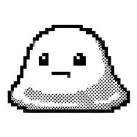 |
| **1** | **Tsuno** (つの) | Horned Drake | Aggression (ちから) | 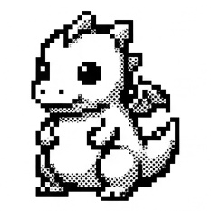 |
| **2** | **Mimi** (みみ) | Shiba Inu | Sociability (めいちゅう) | 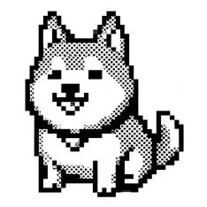 |
| **3** | **Toge** (とげ) | Spiked Drake | Aggression (ちから) | 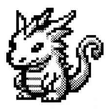 |
| **4** | **Shima** (しま) | Tabby Cat | Curiosity (すばやさ) | 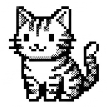 |
| **5** | **Wakka** (わっか) | Forest Owl | Intelligence (かしこさ) | 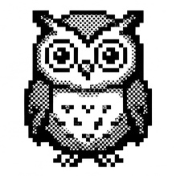 |
| **6** | **Hire** (ひれ) | Aquatic Fin | Curiosity (すばやさ) | 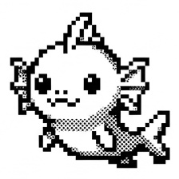 |
| **7** | **Oukan** (おうかん) | Frog Prince | Sociability (めいちゅう) | 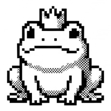 |
| **8** | **Kora** (こうら) | Armored Snail | Intelligence (かしこさ) | 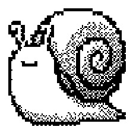 |
| **9** | **Iwa** (いわ) | Stone Golem | Aggression (ちから) | 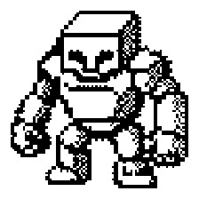 |
| **10** | **Kitsune** (きつね) | Mystic Fox | Curiosity (すばやさ) | 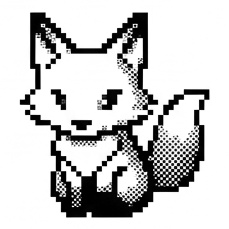 |
| **11** | **Sanshou** (さんしょう) | Salamander | Sociability (めいちゅう) | 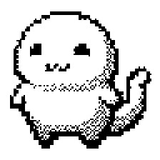 |

---

## System Architecture

The firmware utilizes an asymmetric FreeRTOS dual-core pipeline on the ESP32-S3, isolating heavy background cellular simulations and radio entropy generation from deterministic UI rendering and state-machine transitions:

```mermaid
flowchart TB
    subgraph HostPC ["Desktop Companion Station (Python 3.12 / Raylib)"]
        UI["Interactive 3D Voxel Terrarium<br/>Brian's Brain Hologram & Social Radar"]
        VINK["Virtual E-Ink Mirror (296x128 1-bit)"]
    end

    subgraph ESP32S3 ["Heltec Vision Master E290 (ESP32-S3R8 @ 240MHz)"]
        subgraph Core0 ["Core 0: Phenomenon & Entropy Worker"]
            BB["Brian's Brain 48x12 Cellular Automata<br/>(Ready -> Firing -> Refractory)"]
            ENT["Sub-GHz Radio Noise Pool<br/>Environmental Evolutionary Pressure"]
        end

        subgraph Core1 ["Core 1: Autonomous Life & UI Engine"]
            AI["Utility AI & State Machine<br/>(Idle, Sleep, Eat, Play, Train, Comm)"]
            MF2["MF2 Training & Overwork Servo<br/>(Dice Roll & Health Decay)"]
            GENE["4-Zone Chimera Inheritance<br/>(Head, Back, Belly, Aura)"]
        end

        subgraph Peripherals ["Hardware Interfaces"]
            LORA["Semtech SX1262 LoRa (923MHz)<br/>Decentralized Ad-hoc Mesh"]
            EINK["2.9\" Monochrome E-Ink (SSD1680)<br/>Fast Partial Refresh Driver (GxEPD2)"]
            NVS["Flash Storage (NVS)<br/>Strict 48-Byte State Persistence"]
        end
    end

    HostPC <== "USB-CDC Serial (115200 bps)<br/>Telemetry JSON & Host Commands" ==> ESP32S3
    Core0 -- "Environmental Pressure / CA Bias" --> Core1
    Core1 -- "Social Broadcast Packets" --> LORA
    LORA -- "Acquaintance Discovery" --> Core1
    Core1 -- "1-Bit Bitmaps + Fusion Anchors" --> EINK
    Core1 -- "Differential Checksum Save" --> NVS
```

---

## Low-Level Memory Architecture (48-Byte Packed Creature)

To maximize SPI flash write endurance, prevent NVS sector thrashing, and fit within ESP32-S3 L1 data cache lines, creature state is packed into **exactly 48 bytes**, strictly guaranteed at compile time via `static_assert(sizeof(Creature) == 48, ...)`:

```text
================================================================================
OFFSET  SIZE  FIELD              TYPE          DESCRIPTION
================================================================================
+0x00   4 B   id                 uint32_t      Unique Creature GUID (CRC32 seed)
+0x04   2 B   generation         uint16_t      Lineage Generation Counter
+0x06   1 B   morph_id           uint8_t       Base Species ID (0..11)
+0x07   1 B   flags              uint8_t       Bitflags (Sleeping, Sick, Exhausted)
+0x08   4 B   fusion_genes       Gene4Slot     4-Zone Chimera Slots (Head/Back/Belly/Aura)
+0x0C   1 B   hunger             uint8_t       Satiety Gauge (0..100)
+0x0D   1 B   energy             uint8_t       Vital Energy Gauge (0..100)
+0x0E   1 B   happiness          uint8_t       Emotional Valence (0..100)
+0x0F   1 B   health             uint8_t       Physical Integrity (0..100)
+0x10   4 B   aptitude           Stats4        MF2 Traits: Int / Aggr / Curio / Soc
+0x14   3 B   nature             Traits3       Personality: Patience, Sociability, Play
+0x17   1 B   reserved           uint8_t       Explicit 32-bit boundary alignment
+0x18   4 B   birth_time         uint32_t      RTC Epoch Timestamp (Birth)
+0x1C   4 B   last_update        uint32_t      RTC Epoch Timestamp (Last Processed Tick)
+0x20   4 B   exp_total          uint32_t      Cumulative Experience Points
+0x24   4 B   overwork_points    uint32_t      Cumulative Fatigue & Exhaustion Index
+0x28   8 B   social_summary     uint64_t      Top Acquaintance GUID Hash & Affinity
================================================================================
TOTAL SIZE: 48 BYTES (384 BITS) — ZERO HEAP ALLOCATION
```

---

## Technical Highlights

### 1. Decentralized LoRa Mesh Ecology
* **Zero Infrastructure**: Completely autonomous sub-GHz ad-hoc communications over the 923MHz band (Semtech SX1262).
* **Social Ledger**: Tracks up to 6 recognized neighboring devices with dynamic bidirectional affinity (-100 to +100). Sustained positive encounters establish `BONDED` pacts; territorial conflicts trigger `RIVAL` states.
* **Autonomous Interaction Protocol**:
  * `HELLO` / `STATUS`: Heartbeat telemetry and species announcement.
  * `GREET`: Affinity exchange and emotional synchronization.
  * `FOOD`: Emergency nutritional sharing (altruistic behavior).
  * `FIGHT` / `TRADE`: Competitive sparring and gene token exchanges.

### 2. Brian's Brain Cellular Automaton ("Phenomenon Field")
Core 0 runs an ambient 48×12 cellular automaton simulating primordial physical phenomena:
$$\text{State}(x, y, t+1) = 
\begin{cases} 
\text{Firing}, & \text{if State}(t) = \text{Ready and } \sum \text{Firing Neighbors} = 2 \\ 
\text{Refractory}, & \text{if State}(t) = \text{Firing} \\ 
\text{Ready}, & \text{if State}(t) = \text{Refractory} 
\end{cases}$$
Coupled with real-time RF noise entropy sampled from the SX1262 receiver, this field introduces genuine thermodynamic environmental pressure that drives mutation rates and behavioral whims.

### 3. Monster Farm 2-Inspired Training & Overwork Servo
Creatures can be trained to cultivate four primary genetic traits:
* **Intelligence (かしこさ)**: Increases curiosity and social communication success.
* **Aggression (ちから)**: Increases competitive dominance in territorial encounters.
* **Curiosity (すばやさ)**: Boosts exploration frequency and mutation chances.
* **Sociability (めいちゅう)**: Accelerates positive affinity accumulation over LoRa.

#### Aptitude & Dice-Roll Engine
Each species possesses innate aptitudes (Grade A through D). Training checks evaluate aptitude against a pseudo-random roll influenced by current happiness:
* **GREAT !** (+3~4 stat gain, visual joy emote)
* **SUCCESS** (+1~2 stat gain)
* **FAIL** (0 stat gain, stamina wasted)
* **SLACK** (Creature plays hooky, happiness boost, 0 stat gain)

#### Overwork & Health Decay Mechanics
Training consumes **20 Energy**. If training is forced when $\text{Energy} < 20$, an **OVERWORK** penalty triggers:
$$\text{OverworkRisk} = \frac{20 - \text{Energy}}{20} \times 100\%$$
Overwork inflicts severe health penalties, accumulates lifetime fatigue (`overwork_points`), and triggers the `SICK` mood with unique visual emotes.

---

## Hardware Specification

| Component | Specification | Pin Assignment / Interface |
| :--- | :--- | :--- |
| **MCU** | ESP32-S3R8 (Dual-Core Xtensa LX7 @ 240MHz, 8MB PSRAM, 16MB Flash) | Embedded |
| **E-Ink Display** | 2.9" Monochrome E-Paper (296x128, SSD1680) | CS: 3, DC: 2, RST: 1, BUSY: 4, SPI |
| **LoRa Radio** | Semtech SX1262 Sub-GHz Transceiver (923MHz) | NSS: 8, RST: 5, BUSY: 13, DIO1: 14, SPI |
| **User Input** | Tactile Push Buttons | `BOOT` (GPIO 0), `SIDE` (GPIO 21) |
| **Serial Bus** | USB-CDC Hardware Virtual COM | 115200 bps, 8-N-1 |

---

## Controls & Interaction

### Physical Buttons
| Button | Input Type | Action | Description |
| :--- | :--- | :--- | :--- |
| **BOOT Button** | Short Click (< 0.5s) | **FEED** | Nourish creature (restores hunger, slight happiness boost) |
| **BOOT Button** | Long Press (> 1.2s) | **SHARE FOOD** | Broadcast emergency food nutrient packet over LoRa |
| **SIDE Button** | Short Click (< 0.5s) | **PLAY** | Interactive play (boosts happiness, consumes energy) |
| **SIDE Button** | Long Press (> 1.2s) | **TRAIN** | MF2-style training focused on species-dominant aptitude |

### Serial Command Interface (115200 bps)
```text
FEED                      # Feed creature immediately
PLAY                      # Play with creature
TRAIN [INT|AGGR|CURIO|SOC]# Execute targeted or auto training
TIME <unix_timestamp>     # Synchronize system RTC with host PC
SP                        # Query species and morph metadata
FZ                        # Query 4-zone equipped chimera genes
AFF                       # Print social acquaintance ledger & affinities
BENCH                     # Benchmark sprite renderer cycle count
REBORN                    # Trigger generational succession
```

---

## PC 3D Companion Station

The companion station (`pc-companion/companion.py`) provides an interactive 3D observation terrarium powered by **Raylib**:

```bash
cd pc-companion
run.bat   # Windows one-click launcher (or: uv run companion.py)
```

* **3D Voxel Terrarium**: Real-time rendering of your creature with dynamic lighting, animations, and rotating Brian's Brain CA hologram.
* **Virtual E-Ink Mirror**: Pixel-perfect 296x128 monochrome display emulation updated in real-time with physical device state.
* **Social Radar**: Visualizes nearby discovered LoRa creatures, distances, and affinity statuses (`NEUTRAL`, `BONDED`, `RIVAL`).
* **Telemetry & Care Deck**: Interactive control terminal (`FEED`, `PLAY`, `TRAIN`, `TIME SYNC`, `SNAPSHOT`).

---

## Building & Flashing

### Prerequisites
* [arduino-cli](https://arduino.github.io/arduino-cli/) with the `esp32` core installed:
  ```bash
  arduino-cli core install esp32:esp32
  ```

### Build & Flash Firmware
```bash
# Compile firmware
arduino-cli compile -b "esp32:esp32:esp32s3:CDCOnBoot=cdc,USBMode=hwcdc,FlashSize=16M,PSRAM=opi,PartitionScheme=app3M_fat9M_16MB" InkLife.ino

# Flash to device (replace COM24 with your serial port)
arduino-cli upload -b "esp32:esp32:esp32s3:CDCOnBoot=cdc,USBMode=hwcdc,FlashSize=16M,PSRAM=opi,PartitionScheme=app3M_fat9M_16MB" -p COM24 InkLife.ino
```

---

## Repository Structure

```text
InkLife/
├── InkLife.ino             # Core entry point (setup, loop, FreeRTOS tasks)
├── src/
│   ├── display/            # Screen rendering (GxEPD2, 60 XBM morph arts, chimera anchors)
│   ├── life/               # 48-byte packed Creature model & state transitions
│   ├── behavior/           # Utility AI (action selection & hysteresis)
│   ├── ui/                 # Action servos (feed, play, MF2 training & overwork)
│   ├── genetics/           # Breeding, mutation & 4-zone chimera fusion
│   ├── env/                # 48x12 Brian's Brain CA & RF entropy pool
│   ├── radio/              # SX1262 LoRa ad-hoc mesh protocol
│   ├── hardware/           # GPIO, power rails, debounced buttons
│   ├── core/               # FreeRTOS background worker tasks (Core 0)
│   ├── power/              # Deep sleep & battery voltage monitoring
│   ├── storage/            # High-endurance Flash NVS persistence
│   └── time/               # RTC timekeeping & epoch calculation
├── assets/                 # 96x96 1-bit master pixel art assets
├── pc-companion/           # 3D Raylib desktop observation station
└── tools/                  # Art conversion pipelines (jpg2ink.py, make_artjs.cjs)
```

---

## License

This project is licensed under the [MIT License](LICENSE).
